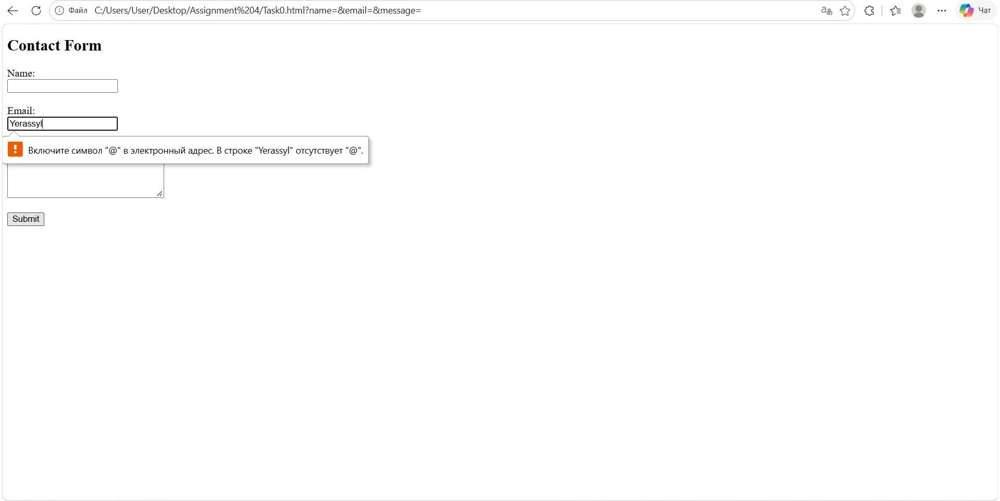
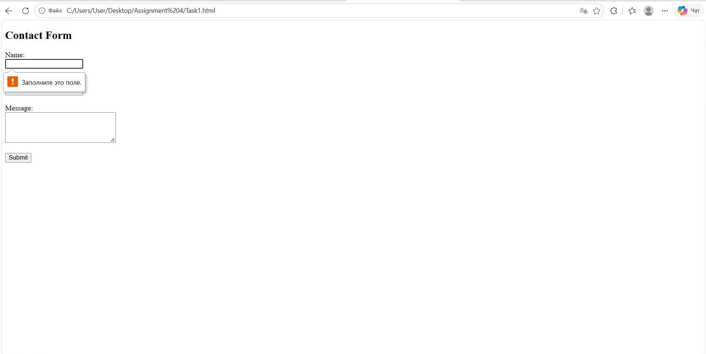
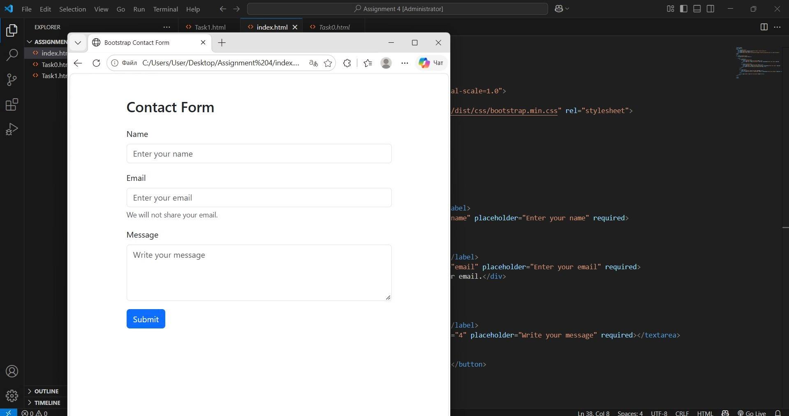
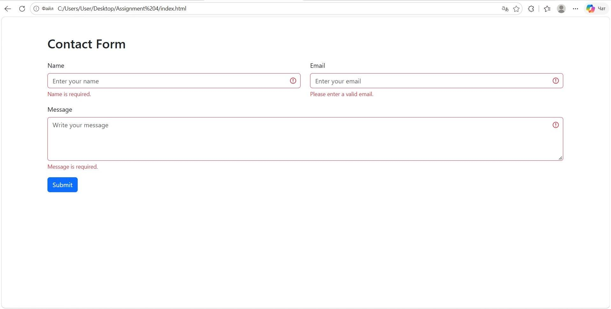

# Assignment 4 - Forms and Validation

**Name:** Yerassyl Nauryzgali
**Group:** IT-2513

## Objective

The objective of this assignment is to create HTML forms, use Bootstrap for styling, and apply form validation.

## Task 0 - Simple Contact Form

I created a simple contact form using HTML. The form contains name, email, message fields and a submit button. Each field has a label.

## Task 1 - HTML5 Validation

I added HTML5 validation attributes such as required, type="email" and maxlength. These attributes help check user input.

## Task 2 - Bootstrap Form Styling

I used Bootstrap to style the contact form. I added form-control, form-label, container, row and col-md-6 classes to make the form responsive.

## Task 3 - Bootstrap Validation

I added Bootstrap validation classes such as is-valid and is-invalid. JavaScript checks the input fields and displays feedback messages.

## Task 4 - Registration Form

I created a registration form using HTML, Bootstrap and JavaScript.

The form includes:

- First Name and Last Name
- Email
- Password and Confirm Password
- Gender
- Hobbies
- Country
- Submit and Reset buttons

I also added validation for required fields, email format, password length and password confirmation.

## Technologies Used

- HTML5
- Bootstrap 5
- JavaScript

## Summary

In this assignment, I learned how to create HTML forms and validate user input. First, I created a basic contact form. Then I added HTML5 validation and Bootstrap styling. After that, I used JavaScript to display validation feedback. Finally, I created a registration form with different input types and validation.

All five tasks were completed and tested in the browser.
